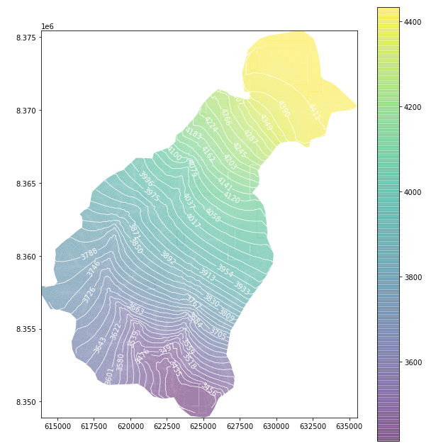

# Contenido
Este repositorio contiene aplicaciones de hidrogeologia

- [Modelo Regional de Aguas Subeterraneas](https://github.com/JoseZevallosR/dev_mode/blob/main/examples/notebooks/basin_mf6.ipynb)